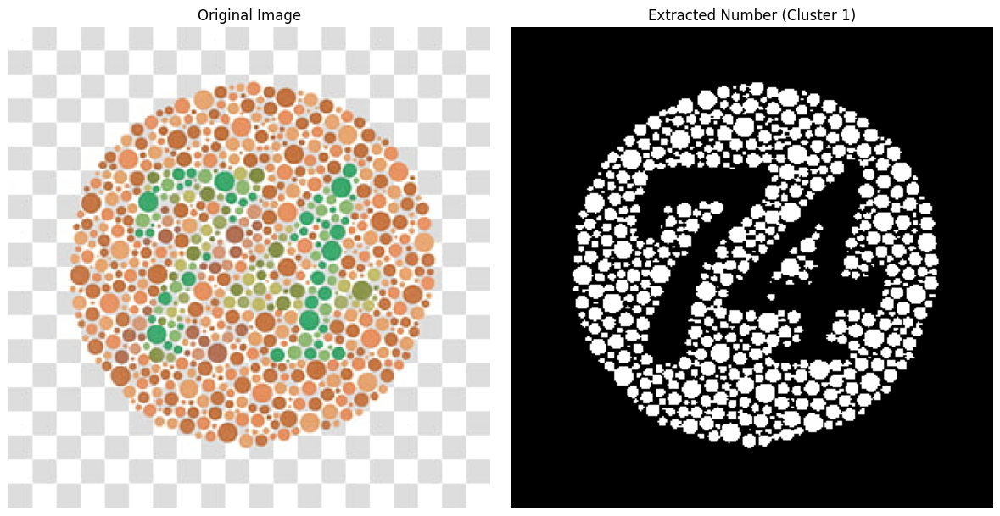

# K-Means from Scratch (with K-Means++) for Ishihara Test Analysis

 
<!-- Update this URL to your notebook file on GitHub -->

Implements K-Means clustering from scratch in Python/NumPy, featuring **K-Means++ initialization** and multiple runs (`n_init`) for robustness. The notebook applies this to Ishihara color blindness tests, using the **LAB color space ('a' channel)** and a **heuristic** to automatically extract the hidden number.

## Key Features

*   **Robust K-Means from Scratch:** Includes K-Means++, `n_init`, `random_state`.
*   **LAB Color Space Analysis:** Clusters pixels based on the 'a' channel (green-red).
*   **Heuristic Number Extraction:** Automatically identifies the likely number cluster based on 'a' channel values and creates a binary mask.
*   **Colab Ready:** Includes file upload and visualization within the notebook.

## Example Result

 

## How it Works Briefly

1.  Loads image, converts to LAB color space.
2.  Applies scratch K-Means (k=2) to the 'a' channel pixels.
3.  Identifies the cluster with the higher 'a' value center (assumed to be the number).
4.  Generates and displays a binary mask of that cluster.

## Usage

1.   .
2.  **Run Setup Cells:** Execute imports and class/function definitions.
3.  **Upload Image:** Run the upload cell and select your Ishihara image.
4.  **Run Process Cell:** Execute the final cell to perform clustering and view results (original image vs. extracted number mask).

## Customization

*   Modify `num_clusters` (default 2) in the final processing cell call.
*   Adjust K-Means parameters (`n_init`, `max_iters`, etc.) within the `process_image` function.
*   Toggle normalization of the 'a' channel (commented out by default) in `process_image`.

## Limitations

*   Relies heavily on the LAB 'a' channel heuristic for number identification.
*   Effectiveness depends on image quality and color separation.
*   K-Means itself can sometimes find suboptimal clusters (though K-Means++ and `n_init` mitigate this).
